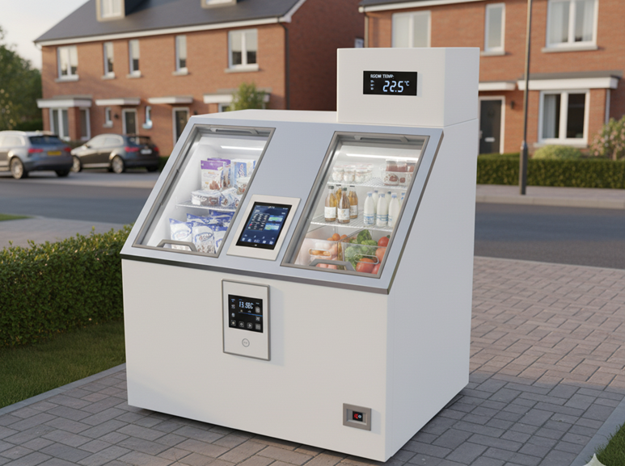

# ReServe_Box
ReServe, een lokaal opslag punt voor voedseloverschotten die nog eetbaar zijn.

🛠️ Built by ``Victor Raes``, ``Bas Matthys`` & ``Oskar Sergier``   
🔥 Supervised by ``prof. dr. Bas Baccarne``, ``Yannick Christiaens`` & ``Wouter Devriese``    
🌱 Grown at ``Ghent University`` 🏛️ ``Industrial Design Engineering`` ([project overview](https://github.com/basbaccarne/human-centered-design))       

*13/11/2025 van de laatste update*   

## Samenvatting
Voedselverspilling is een groeiend duurzaamheidsprobleem, waarbij een groot deel ontstaat in huishoudens. Hoewel buurtkastjes een laagdrempelige oplossing bieden, tonen onze onderzoeksmethoden benchmarking van bestaande systemen, een Google Forms enquête, twee interviews met wijkbewoners en een interview met een initiatiefnemer, aan dat deze kastjes kampen met grote knelpunten. De belangrijkste problemen zijn gebrek aan voedselveiligheid, onzekerheid over wat mag worden gedeeld, wantrouwen bij gebruikers en beperkte controle over de kwaliteit van aangeboden producten. Hierdoor blijven buurtkastjes vaak ongebruikt of verkeerd gebruikt, waardoor ze hun duurzaamheidsdoel missen.

Onze oplossing hiervoor is **ReServeBox**: een phygital buurtvoedselkast die veilig, duidelijk en betrouwbaar delen van voedsel in de wijk stimuleert. De ReServeBox combineert een fysieke kast met compartimenten en beschermde opslag met een digitale laag via QR-codes of een eenvoudige app. Deze digitale interface toont richtlijnen, vervaldata, meldingen en herkomstinformatie. Zo creëren we transparantie, vertrouwen en gebruiksgemak.

ReServeBox lost het probleem op door bewoners een gecontroleerde, veilige en toegankelijke manier te bieden om overschotten te delen. Hierdoor krijgen producten een tweede leven, wordt voedselverspilling actief verminderd en groeit de sociale verbondenheid binnen de buurt. Dankzij betere structuur, duidelijke regels en feedback blijft het systeem betrouwbaar en duurzaam bruikbaar.

## Introductie

Voedselverspilling vormt een groeiend mondiaal en lokaal duurzaamheidsprobleem. Jaarlijks gaat naar schatting een derde van al het geproduceerde voedsel verloren (FAO, 2023). In Europa blijkt dat vooral huishoudens een grote bijdrage leveren aan deze verspilling, vaak door overstocking, verkeerde inschattingen of gebrek aan kennis over houdbaarheid (van Geffen et al., 2020). Dit leidt niet enkel tot ecologische schade, maar ook tot onnodige financiële kosten en verlies van sociale waarde binnen buurten. Hoewel buurtvoedselkastjes een laagdrempelig alternatief bieden om overschotten te delen, tonen recente studies aan dat deze systemen kampen met problemen rond voedselveiligheid, betrouwbaarheid en duidelijke richtlijnen (Thomas & Ritter, 2022).

Mijn onderzoek via interviews, een Google Forms-bevraging en literatuur onderzoek wijst uit dat buurtbewoners bereid zijn voedsel te delen, maar drempels ervaren zoals onzekerheid over wat mag, angst voor bederf en een gebrek aan transparantie. Hierdoor blijven veel bestaande buurtkastjes onderbenut of worden ze foutief gebruikt.

Met ReServeBox willen wij deze kloof dichten door een phygital buurtvoedselkast te ontwikkelen die fysieke toegankelijkheid koppelt aan digitale transparantie. De doelstelling is een systeem te creëren dat voedseloverschotten opnieuw waarde geeft, duurzame gewoontes stimuleert en sociaal vertrouwen versterkt binnen de wijk.

Max 300 woorden.
Kader je project. Introduceer het probleem en jouw doelstellingen (inclusief boundary conditions).
Maak gebruik van bronverwijzingen ([zie APA stijl](https://www.scribbr.nl/category/apa-stijl/)). Zoals bijvoorbeeld (Thomas & Ritter, 2022) [^1] .

## Inhoudstafel

1. [Methodologie](./docs/methodologie.md)
2. [Discovery](./docs/discovery.md)
3. [Defintion](./docs/definition.md)
4. [Design Requirements](./docs/design_requirements.md)
5. [Bill of materials](./docs/bom.md)

## Kritische reflectie
Max. 500 woorden

## Noot inzake het gebruik van AI
Licht toe op welke manier je AI gebruikte in dit project.

## Bijlagen
### Discovery
* Literatuuronderzoek (N=x)
  * [Protocol](url)
  * [Rapport](url)
* Interviews (N=x)
  * [Protocol](url)
  * [Rapport](url)
    
### Definition
* User testing wave 1 (N=x)
  * [Protocol](url)
  * [Rapport](url)
* User testing wave 2 (N=x)
  * [Protocol](url)
  * [Rapport](url)

## Licentie
> :warning: voeg jullie namen toe in de documenten hieronder en delete dan dit lijntje   

This repository contains both software and design materials created as part of an industrial design energineering project at Ghent University.

- **Software and code:** [MIT License](./LICENSE-MIT)  
- **Design, documentation, CAD, and media:** [CC BY 4.0 License](./LICENSE)
  
You are free to reuse and build upon this work, both commercially and non-commercially, as long as proper attribution is given to the original authors.

## Bronnen
 [^1]: Thomas, T., & Ritter, A. (2022). Wandering & sundowning in dementia. _Practical Neurology, 21_(3), 36–44.
